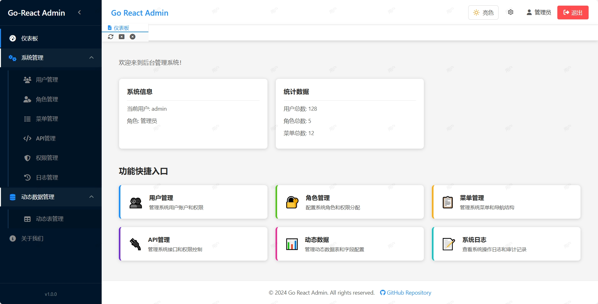

# Go React Admin

一个使用Go（Gin, GORM）和React构建的管理后台系统。

## 项目简介

Go React Admin是一个基于前后端分离架构的现代化管理系统，专为需要快速构建企业级后台应用的开发者设计。后端采用Golang Gin框架，前端采用React框架，数据库使用MySQL。系统支持多租户架构，配置采用环境变量（.env文件）格式。

主要功能包括权限管理、用户管理、角色管理、菜单管理、API管理、日志管理等，适用于各种企业级应用场景。


## 在线体验
<a href="http://hantukeji.net:13000/" style="color: #1890ff; text-decoration: underline;">Go React Admin 在线体验 http://hantukeji.net:13000/</a>
### 测试账号：
- 用户名：admin
- 密码：123456


## 预览图



## 功能特性

- **权限管理**: 基于JWT实现细粒度权限控制
- **用户管理**: 支持用户信息的增删改查和状态管理
- **角色管理**: 可以为角色分配不同的API权限和菜单权限
- **菜单管理**: 实现用户动态菜单配置和不同角色不同菜单展示
- **API管理**: 支持API接口的增删改查和分组管理
- **日志管理**: 记录用户登录信息和操作行为
- **多租户支持**: 实现租户数据隔离和租户级别的权限控制
- **响应式设计**: 适配不同设备屏幕尺寸

## 技术架构

### 后端技术栈

- **编程语言**: Golang
- **Web框架**: Gin
- **ORM框架**: GORM
- **认证机制**: JWT
- **配置管理**: 环境变量 (.env文件)
- **日志框架**: Zap
- **缓存**: Redis
- **数据库**: MySQL (8.0+)

### 前端技术栈

- **框架**: React 18+
- **路由**: React Router v6
- **构建工具**: React Scripts

## 项目结构

```
go-react-admin/
├── server/          # 后端Go服务
│   ├── api/         # API处理函数
│   ├── config/      # 配置文件
│   ├── global/      # 全局变量
│   ├── initialize/  # 初始化函数
│   ├── middleware/  # 中间件
│   ├── model/       # 数据模型
│   ├── router/      # 路由定义
│   ├── utils/       # 工具函数
│   ├── main.go      # 主程序入口
│   └── go.mod       # Go模块定义
└── web/             # 前端React应用
    ├── public/      # 静态资源
    └── src/         # 源代码
        ├── assets/  # 静态资源
        ├── components/ # 组件
        ├── pages/   # 页面
        ├── routes/  # 路由配置
        ├── store/   # 状态管理
        └── utils/   # 工具函数
```

### 系统架构图
```
┌─────────────────────────────────────────────────────────────┐
│                    Client (React Frontend)                  │
└─────────────────────────────┬───────────────────────────────┘
                              │ HTTPS/API
┌─────────────────────────────▼───────────────────────────────┐
│                      Load Balancer                          │
└─────────────────────────────┬───────────────────────────────┘
                              │
        ┌─────────────────────┼─────────────────────┐
        │                     │                     │
┌───────▼────────┐   ┌───────▼────────┐   ┌───────▼────────┐
│  Web Server 1  │   │  Web Server 2  │   │  Web Server N  │
│  (Gin Backend) │   │  (Gin Backend) │   │  (Gin Backend) │
└───────┬────────┘   └───────┬────────┘   └───────┬────────┘
        │                     │                     │
        └─────────────────────┼─────────────────────┘
                              │
                    ┌─────────▼─────────┐
                    │     Redis         │
                    │  (Session/Cache)  │
                    └─────────┬─────────┘
                              │
                    ┌─────────▼─────────┐
                    │     MySQL         │
                    │  (Multi-tenant)   │
                    └───────────────────┘
```

## 快速开始

### 后端

```bash
# 进入后端目录
cd server

# 安装依赖
go mod tidy

# 运行服务
go run main.go
```

### 前端

```bash
# 进入前端目录
cd web

# 安装依赖
npm install

# 启动开发服务器
npm start
```
# 管理员账号
- 账号：admin
- 密码：123456

## 功能特性完成情况

- [x] 用户认证 (JWT)
- [x] 用户管理
- [x] 角色管理
- [x] 菜单管理
- [x] API管理
- [x] 日志管理
- [x] 多租户支持
- [ ] 权限控制
- [ ] 数据统计
- [ ] 系统配置

## 部署

项目支持 Docker 容器化部署，提供 Docker Compose 配置文件，可一键启动所有依赖服务。

```bash
# 使用 Docker Compose 启动
docker-compose up -d
```

## 项目规划

项目开发分为四个阶段：

1. **基础框架搭建**: 初始化项目结构，集成基础技术栈
2. **核心功能开发**: 实现认证授权、用户、角色、菜单、API、日志等核心模块
3. **系统完善**: 性能优化、安全加固、完善测试
4. **部署与文档**: 编写部署文档，完善各类手册

## 贡献

欢迎提交 Issue 和 Pull Request 来帮助改进项目。

## 许可证

[MIT](https://github.com/your-username/go-react-admin/blob/main/LICENSE) License
